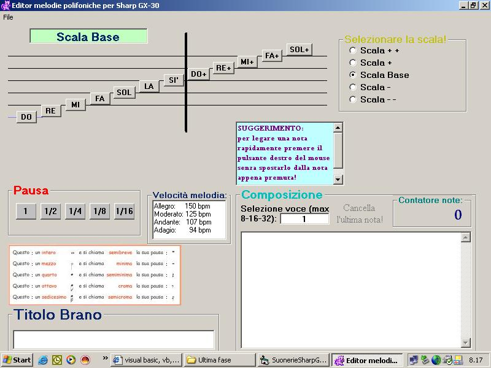



## SharpGX30 PoliEdit

### Description

Sorry if I'm Italian and i don't think you really appreciate my work cause the words is in my language.. But I know that there is some thing that beginners can find helpful. I don't submit this in english version only for the reason that I think most of the people here don't know this cellular! I'm wrong?? But if you want you can adapt code for any type of pholifonic cell. Is there anyone that is able to make it professional by put in all the music for the notes??! This is my first submission and I made it for my father and is new cell.Please be good with me.It's not simple study all by myself.I want to thanks everyone in this community for the good work and I appreciate most of the submissions where I found a lot of good things for my study!!! CIAO!!!
 
### More Info
 

             |
---                |---
**Submitted On**   |2004-10-16 10:08:46
**By**             |[Leporale Michele](https://github.com/Planet-Source-Code/PSCIndex/blob/master/ByAuthor/leporale-michele.md)
**Level**          |Intermediate
**User Rating**    |4.7 (14 globes from 3 users)
**Compatibility**  |VB 6\.0
**Category**       |[Miscellaneous](https://github.com/Planet-Source-Code/PSCIndex/blob/master/ByCategory/miscellaneous__1-1.md)
**World**          |[Visual Basic](https://github.com/Planet-Source-Code/PSCIndex/blob/master/ByWorld/visual-basic.md)
**Archive File**   |[SharpGX30\_18075510192004\.zip](https://github.com/Planet-Source-Code/leporale-michele-sharpgx30-poliedit__1-56817/archive/master.zip)

